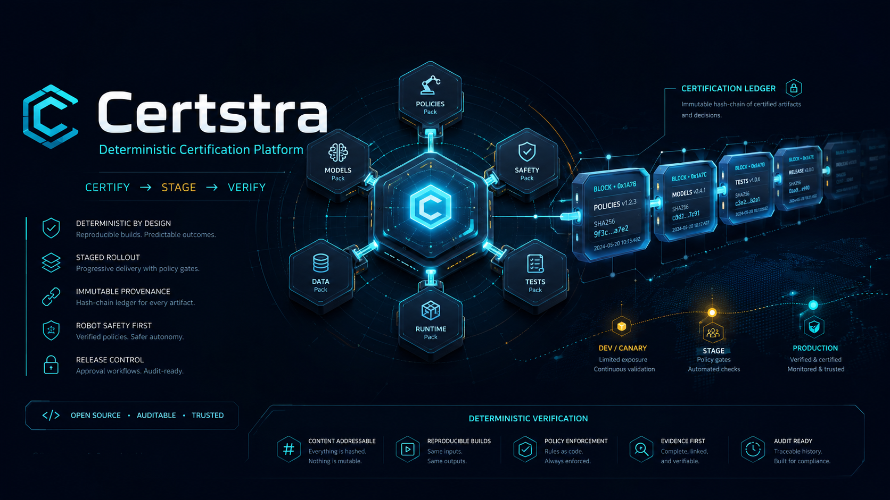

# Certstra

> **로봇 정책·릴리스·사고 증거를 결정론적으로 인증하는 플랫폼.**
> `certify → stage → verify` + hash-chain 인증 원장 — 하나의 커널, N개 도메인 팩.
> **HELIX Condense 레시피가 robotics/release 군집에서 자동 emit한 4번째 `-stra` 플랫폼.**

Certstra는 **하나의 결정론 인증 커널 + N개 도메인 팩** 구조다. HELIX corpus의 robotics/release
군집(CertMesh·ReleaseMesh·RoboTrace·RouteSentinel·OrbiRoam)이 공유하는 인증 기계(certification-drift
verdict + provenance + staged rollout)를 커널로 승격하고, 각 도메인을 팩으로 얹는다.

## -stra 플랫폼 패밀리 (4형제)

| 플랫폼 | 동사 | 역할 |
|---|---|---|
| [Attestra](https://github.com/sadpig70/Attestra) | attest | 위임 행위 증언 |
| [Clearstra](https://github.com/sadpig70/Clearstra) | clear | 시장 청산 |
| [Routestra](https://github.com/sadpig70/Routestra) | route | 자원 라우팅 |
| **Certstra** | **certify** | 로봇 정책·릴리스 인증 |

네 플랫폼은 **verdict severity 대수를 공유**한다: Certstra의 `certifiable < needs_review < blocked`는
Attestra `valid/thin/breach`와 정렬(`to_attestra_verdict`) → 인증 결과를 Attestra가 증언 가능.

## Condense 계보 (이 저장소가 특별한 이유)

Attestra·Clearstra·Routestra는 **손으로** 만들었다. Certstra는 그 3회를 정식화한 **HELIX Condense
레시피**(`_workspace/condense/U2-condense-recipe.md`)를 robotics/release 군집에 적용해 **반자동으로
emit**된 첫 플랫폼이다 — "HELIX가 프로젝트가 아니라 *플랫폼*을 만든다"의 실증.

- **재사용 machine**(검증 완료): ledger(M1)·fingerprint(M14)·determinism·verdict(M2)·provenance(M4) →
  기존 `-stra` 커널에서 이식.
- **신규 machine**: `stage_schedule`(M12 staged rollout) — 이 군집 고유.

## 인증 기계 (실코드 근거)

| 단계 | 커널 함수 | 실코드 근거 |
|---|---|---|
| **certify** | `certify(checks)` — severity 병합 | `CertMesh.certify` (drift → certifiable/needs_review/blocked) |
| **stage** | `plan_stages(release, schedule)` — 단계적 rollout + go/halt | ReleaseMesh 계승 (M12, 신규) |
| **verify** | `verify_provenance(record, chain)` | RoboTrace 사고증거 / OrbiRoam hash-chain 인가 |

`cert-mesh`가 레퍼런스 팩(CertMesh parity).

## 1차 도메인 팩

`cert-mesh`(레퍼런스) · `release-mesh`(certify+stage) · `robo-trace`(certify). 각 팩은 `source_project`로
원본(github.com/sadpig70/*) 추적. 2차: `route-sentinel`·`orbi-roam`.

## 결정론 경계

커널·팩 = 순수 stdlib, 시계·네트워크·AI 없음. 시간은 주입(`now`), hash에서 시간 메타 제외. `certstra
determinism` → clean.

## 라이선스

MIT License © 2026 sadpig70 (Jung Wook Yang)
